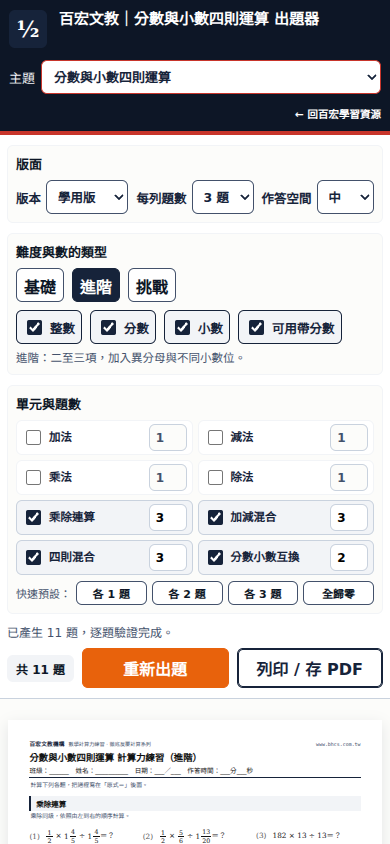
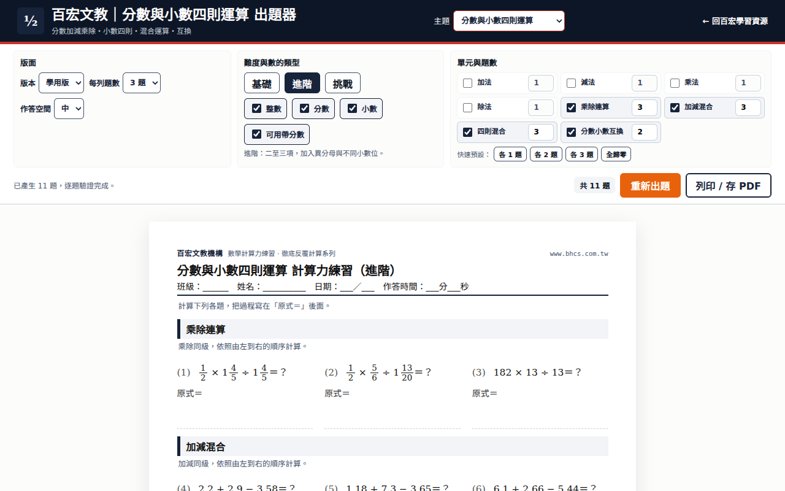
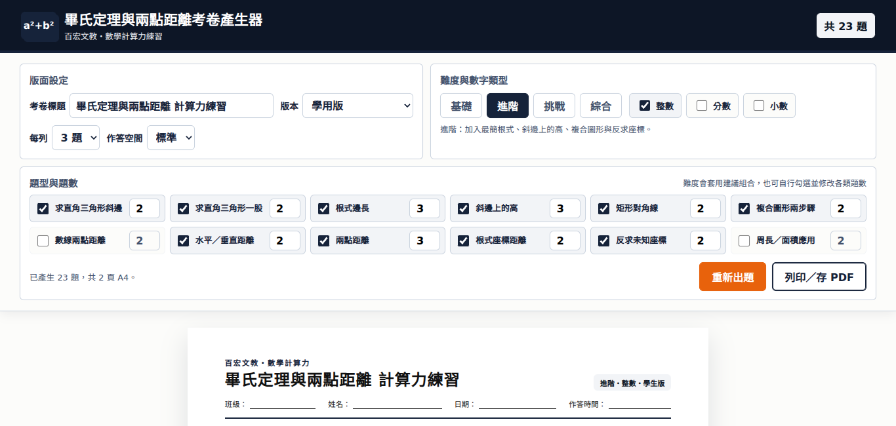
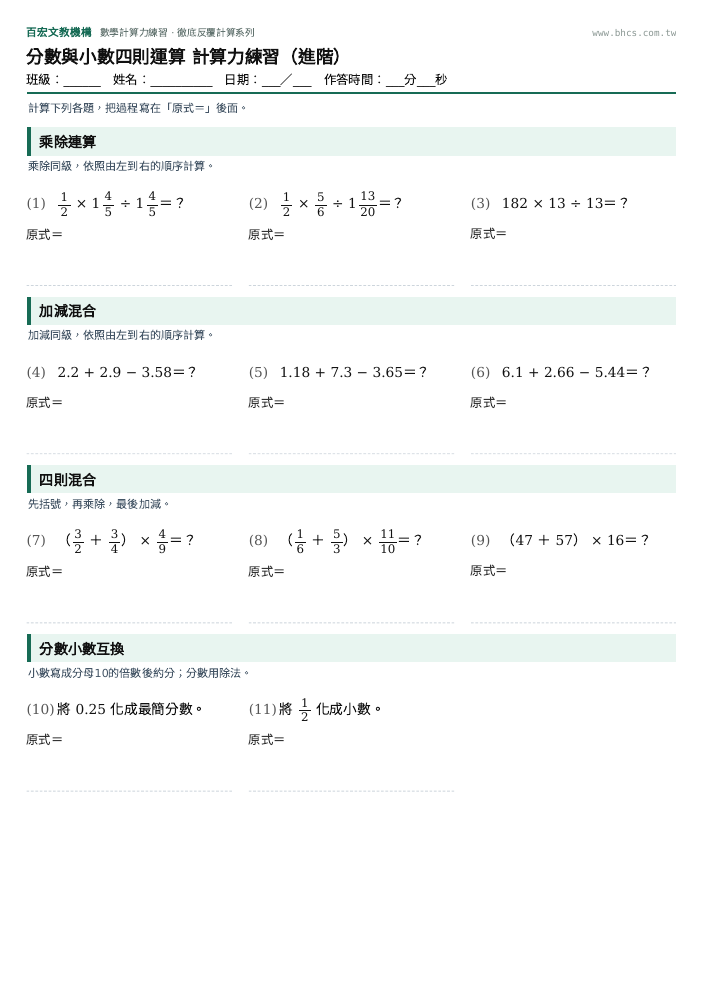
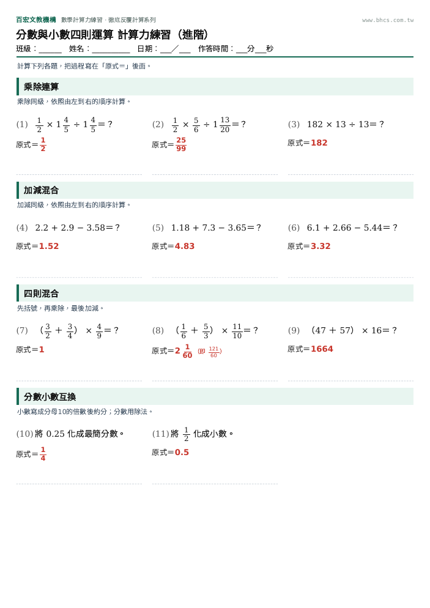

# P1｜數學出題器螢幕品牌配色

編號與 id：**P1 math-brand**。依《BHCS-新教材製作交接包》先完成前置工作；本 PR 不包含 P2 或新教材。

PR／分支／提交：分支 `codex/p1-math-brand`；基準 main `44d5ff330aef60dbe3cb8c12e8b9a01e44afa59f`。實際提交、CI 及部署連結記錄在本 PR。

## 改了哪些來源檔

- `scripts/build_math_brand.mjs`：把品牌配色內嵌進原本的單檔教材。螢幕變數、私有色碼、SVG 顏色、行內顏色與按鈕一起處理；重新出題為橘色，列印為白底墨藍框，圓角 6px。
- 39 個教材檔案：三個 drills 引擎、35 個獨立工具，以及總覽中的 `tools/estimation.html`。88 個入口與 52 個 topic 連結未改；逐檔清單見 [manifest.json](manifest.json)。
- `scripts/check_math_brand.cjs`：與基準逐字比對，除了新增的配色區塊與 theme-color，原始 HTML、JavaScript、CSS／列印規則必須一致。
- `scripts/check_math_brand_browser.cjs`：固定亂數、逐入口檢查畫面與生成卷面，逐檔比對學用／教用列印 DOM、尺寸、文字大小與間距。
- `scripts/check_science_integration.cjs`、CI、README：依 P1 明確授權加入 39 檔的品牌修正範圍，保留 88 卡片斷言，新增建置一致性及瀏覽器驗收。

## 模型或出題邏輯與規格不同之處

**無。沒有更改任何出題 JavaScript。**

為同時滿足「螢幕換色」與「列印樣式不動」，品牌變數與覆寫規則包在 `@media screen`，保留所有原始規則；只有規格要求的教用答案紅字，統一為 `#C8352B`。因此列印仍保有原本的綠／藍色標題或章節底色，版面、題數、分頁不變。

## 測試結果

| 指令／檢查 | 結果 |
|---|---|
| `node scripts/build_math_brand.mjs` | 39 檔；重跑無差異 |
| `node scripts/check_math_brand.cjs` | 88 入口、39 檔；原始程式、HTML、列印規則逐字一致 |
| `node scripts/check_math_brand_browser.cjs` | 88/88 通過；每入口產生相同亂數卷面，螢幕色彩檢查通過，39 檔 × 學用／教用列印結構與幾何相同 |
| 真實 Chromium 截圖 | 每入口 390×844、1280×800、1366×650，共 264 張；人工檢視不同介面家族 |
| 實際 PDF | 六種代表工具 × 學用／教用，12 對改版前後 PDF；頁數及全部文字位置均相同。結果見 [pdf-comparison.json](pdf-comparison.json) |
| `npm test --prefix scripts` | 通過 |
| `node scripts/check_science_integration.cjs` | 97 HTML、1,152 本地引用、91 sitemap 項目通過 |
| `node scripts/test_researcher_batch1.cjs` 至 `batch5` | 通過 |
| GitHub CI | 本機結果不代表 CI；PR 全部綠燈才合併，CI 保存全部截圖及代表 PDF |

實際瀏覽器採固定亂數、固定日期；兩版本皆停用裝飾轉場，避免在列印字級動畫中途取樣。Playwright 截圖會留下空白 `style` 屬性，比對只忽略這種沒有樣式的空屬性。沒有忽略題目、答案或有值的樣式。標題白字的對比修正另重測兩種國三介面，均通過。

## 人工核對：10 題

取 `g6-drills.html?topic=time`，亂數種子 772109；用總秒數／精確分數另算，不呼叫出題器的驗證函式。

| 題目 | 答案 | 另算依據 |
|---|---|---|
| 2 時 36 分 48 秒化成秒 | 9,408 秒 | 7,200 + 2,160 + 48 |
| 1 時 20 分 26 秒化成秒 | 4,826 秒 | 3,600 + 1,200 + 26 |
| 28.9 時化成分 | 1,734 分 | 289/10 × 60 |
| 2.1 時化成分 | 126 分 | 21/10 × 60 |
| 1 時 54 分 59 秒 + 50 分 54 秒 | 2 時 45 分 53 秒 | 6,899 + 3,054 = 9,953 秒 |
| 4 時 1 分 55 秒 + 1 時 51 分 53 秒 | 5 時 53 分 48 秒 | 14,515 + 6,713 = 21,228 秒 |
| 1 時 51 分 8 秒 − 25 分 27 秒 | 1 時 25 分 41 秒 | 6,668 − 1,527 = 5,141 秒 |
| 1 時 55 分 − 1 時 21 分 36 秒 | 33 分 24 秒 | 6,900 − 4,896 = 2,004 秒 |
| 3 時 55 分 40 秒 × 2 | 7 時 51 分 20 秒 | 14,140 × 2 = 28,280 秒 |
| 3 時 8 分 50 秒 × 7 | 22 時 1 分 50 秒 | 11,330 × 7 = 79,310 秒 |

## 截圖

手機 390：

桌機 1280：

短螢幕 1366×650（沿用原操作版面）：

學用版、教用版實際 PDF 第一頁：

## 沒有驗證到的，以及下一項優先處理

- 本次驗證的是 P1 改色前後等價，不是全部題目的數學正確性。每 topic × unit × 難度 × mode 各 200 題，是下一個 **P2** 的工作，尚未執行。
- 目視發現既有 `g9-1-4-trig-ratio.html` 的圖／文不一致：同一固定亂數卷第 1 題，題幹寫 AB=13、BC=5、AC=12，但圖的 AC 標 5、BC 標 12。`renderSvgRightTriangle()` 的頂點固定，呼叫卻傳相對於目標角的對邊／鄰邊。基準版本已有此問題；P1 不改出題程式，應在新增教材前以獨立修正處理，並加入圖文一致性測試。
- 未使用實體印表機；未聲稱已驗證所有作業系統與瀏覽器。預覽截圖使用本機中文字型；CI 另安裝 Noto CJK 與 emoji 字型。
- 6 種代表工具已檢視實際 PDF；其餘檔案以原始列印規則、學用／教用卷面 DOM 與完整幾何比對驗收。

需要使用者決定的：P1 無額外設定。下一項依交接包為 P2；「等講義」項目保持未開工。
