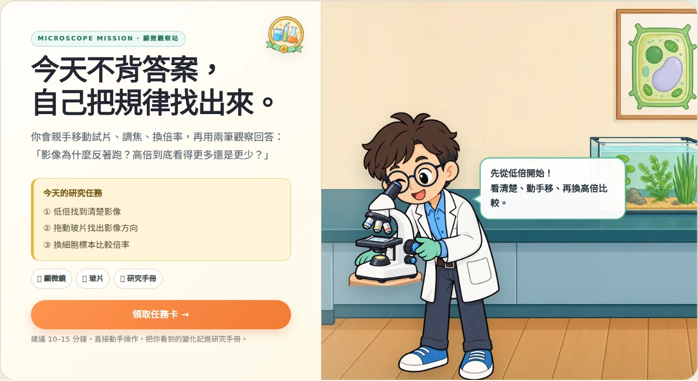
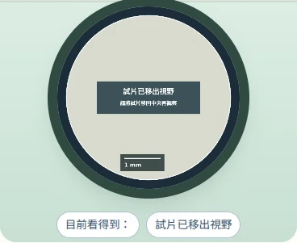
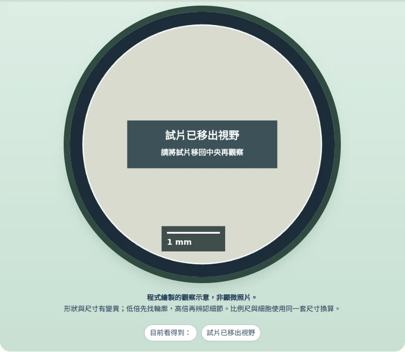

# 歡迎畫面構圖與顯微鏡瀏覽器驗收

基底：`6b70bf3fde1fbe966e8791591a85197ef59932d1`。已完整閱讀 2026-09-20 交接文件，核對遠端 main 與未合併 PR 後，從乾淨分支整合；未重推舊歷史或直接修改 main。

## 修正原因與結果

交接候選版在 63 組幾何檢查全部通過後，目視仍發現桌機顯微鏡背景裁切方向錯誤、平板氣泡遠離人物、尾巴偏向背景器材。修正生物背景裁切，保留人物左、提示右；氣泡依圖片實際顯示範圍、已校準的嘴部位置與文字高度對位。尾巴維持短缺口，ResizeObserver 處理尺寸、字型與畫面切換後的變化。

只有無方向性教學資訊的生物裝飾場景鏡像；化學、地科、物理保持原方向。顯微鏡桌機及手機裁去重複背景顯微鏡；平板保留寬景，背景器材在右，與人物分開。沒有重繪素材或變更科學模型。

CSS / JS 同時更新網址版本，20 站與總覽由 build_science 重建。移除以精確 CSS 字串假裝視覺驗收的斷言，改為 Chromium 實際量測與截圖。

## 本機實際結果

| 檢查 | 結果 |
|---|---|
| 歡迎畫面：20 站＋總覽 × 390 / 768 / 1280px | 63 / 63；逐頁檢視場景截圖與代表完整頁 |
| 圖片、水平溢位、人物與氣泡邊界、文字容納、臉部遮擋、JS error | 63 / 63 |
| 短尾巴方向與嘴部近似位置 | 63 / 63；垂直誤差 ≤ 4px |
| 顯微鏡：4 種標本 × 手機 / 桌機 | 8 / 8；觸控或滑鼠實際拖曳，空視野、空紀錄、Home 復位 |
| 研究手冊 / 挑戰頁 / 歷史返回 / 同頁連續縮放 320–1280px | 通過 |
| npm test | 23 模型群組及既有 UI、圖解、互動、探究紀錄回歸通過 |
| check_science_integration | 97 頁 / 1092 本機引用 / 91 sitemap URL 通過 |
| researcher batch 1–5 | 全部通過 |

本機瀏覽器為 Chromium 153.0.8010.0（npm 提供的 headless binary）、Playwright 1.58.2、Node 24，已安裝 Noto CJK。標準 Playwright CDN 在此環境下載逾時；只用外部測試啟動器指定執行檔，未把替代執行環境放入網站。CI 使用標準 Playwright 1.58.2 Chromium、Noto CJK 與 emoji 字型。可由 `environment.json`、`results.json`、`browser-regressions.json` 核對本機數據。

## 代表畫面

### 顯微鏡

手機：


平板：


桌機：



### 共用物理場景與研究基地


### 移出試片後的實際畫布






## 重現與範圍

```sh
node scripts/build_microscope.mjs
node scripts/build_science.mjs
npm test --prefix scripts
node scripts/check_science_integration.cjs
node scripts/test_researcher_batch1.cjs
node scripts/test_researcher_batch2.cjs
node scripts/test_researcher_batch3.cjs
node scripts/test_researcher_batch4.cjs
node scripts/test_researcher_batch5.cjs
NODE_PATH=/tmp/bhcs-composition/node_modules node scripts/check_researcher_composition.cjs
NODE_PATH=/tmp/bhcs-composition/node_modules node scripts/check_researcher_browser.cjs
```

CI 上傳 `researcher-composition-review`，包含全部 63 張完整歡迎畫面、63 張場景截圖及 16 張顯微鏡視野截圖，保留 14 天。本目錄保留代表截圖與本機結果。

這是本批歡迎構圖與顯微鏡回歸驗收，不能推論所有教材操作、20 張圖示科學結構、教案、對比度、實體手機與列印全部驗收。尾巴定位使用既有角色素材的校準比例，將來換角色姿勢須重新校準。觸控為 Chromium CDP 模擬，非實體手機。尚未合併或部署正式站。本機 emoji 字型不足，少數裝飾符號使用缺字 fallback；CI 已配置 emoji 字型，網站不打包本機字型。
