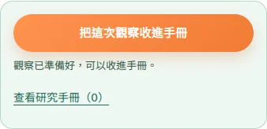
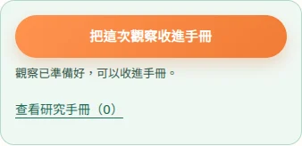
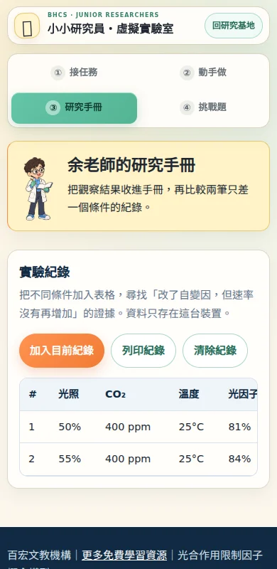
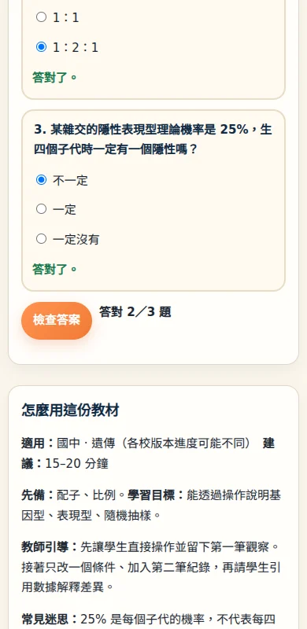
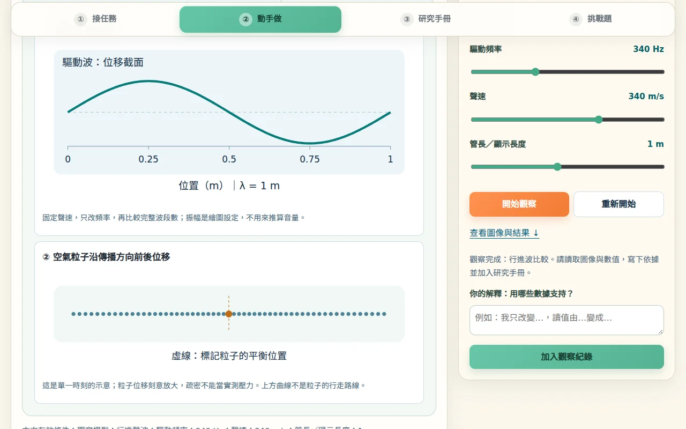
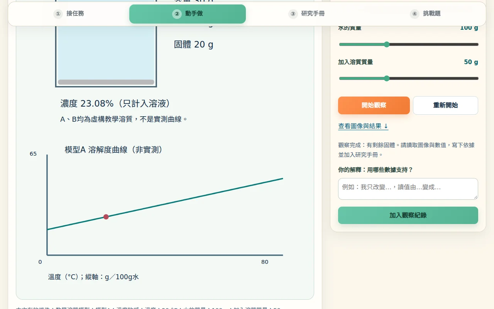
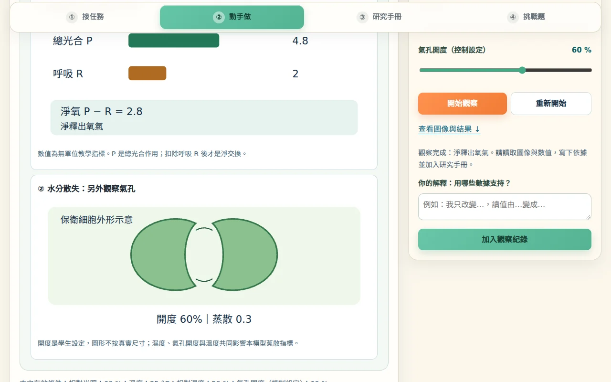
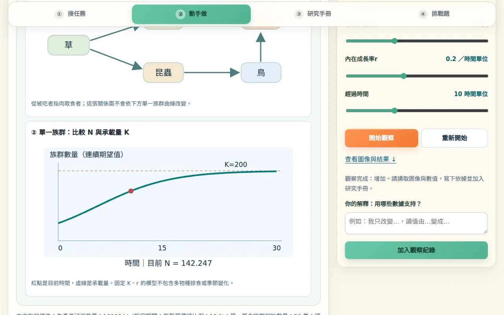

# 研究站操作與紀錄流程驗收

本階段承接 PR #15 的 `309e27cafa64d0676a722300188af0093dcba933`，驗收實際的「動手做 → 保存 → 第二筆比較 → 研究手冊 → 挑戰題」。PR #15 尚未合併，因此本階段 PR 以其分支為 base，方便單獨審查增量；不包含合併或正式部署。

## 重現問題與修正

| 範圍 | 原本行為 | 修正後行為 |
| --- | --- | --- |
| 第一批 10 站 | 除顯微鏡外，9 站必須先切至手冊才能保存；顯微鏡入口離控制器較遠 | 10 站統一在控制區提供保存、狀態文字與手冊筆數入口，沿用既有保存邏輯及 disabled 狀態 |
| 第一批 10 站挑戰題 | 未作答即顯示 0 分及錯誤提示；修改答案仍留舊評分 | 未答題先引導補答；修改後清除該題回饋並要求重新檢查 |
| 全部 20 站手冊 | 兩筆後只隱藏返回按鈕，仍留提示文字；清空後提示未即時恢復 | 整段提示依目前筆數同步顯示／隱藏 |
| 桌機六站長圖 | 波動、溶解度、四季、植物、生態、月相的後段圖解藏在固定高度面板內 | 長圖隨頁面自然展開，保留手機放大後的面板內捲動 |

入口構圖、科學模型和教材內容沿用前階段。生成頁僅更新共用 CSS／JS 的版本網址；來源是 `scripts/build_science.mjs`，沒有手改生成頁。

## 實際瀏覽器驗收

`check_researcher_operations.cjs` 使用 Playwright 真實點擊、選單及鍵盤操作，沒有直接呼叫模型函式。20 站各驗收 390 × 800、1280 × 800，共 **40／40 通過**，無頁面 JS 錯誤。

每組流程檢查：

1. 完成操作，從動手做畫面保存第一筆。
2. 從手冊返回，改一個條件；需要重新執行的站會停用保存，顯微鏡則即時更新標本。
3. 保存第二筆，確認紀錄內容不同，兩筆提醒整段消失。
4. 重新載入仍保留兩筆；清空後恢復提示。
5. 未作答不判錯；全答對為 3／3；改答後清除舊回饋，再檢查為 2／3。
6. 長圖不再有預設的垂直內捲動，頁面沒有水平溢出。

已逐張複核手機保存入口與手冊截圖、代表挑戰題，以及桌機十站圖解。另實際捲到六站長圖底部，確認尾端文字可讀，並確認手機放大沒有造成整頁水平溢出。長圖仍需捲動頁面閱讀，不代表所有圖解在一屏內同時顯示。

其他回歸：

- `check_researcher_composition.cjs`：21 頁 × 390／768／1280，**63／63 通過**。
- `check_researcher_browser.cjs`：顯微鏡四標本 × 兩種寬度，**8／8 通過**；包含真實滑鼠／觸控拖曳、移出標本、空白視野紀錄、Home 復位、導覽及即時調整視窗。
- `npm test --prefix scripts`、`check_science_integration.cjs`、`test_researcher_batch1.cjs` 至 `batch5.cjs` 通過。
- 顯微鏡與科學頁生成器重建、`git diff --check` 通過。

本地環境：Chromium 153.0.8010.0、Playwright 1.58.2、Node 24.19.0，安裝繁中 Noto 字型；本地部分裝飾 emoji 字型缺字。GitHub Actions 使用 Playwright 配套 Chromium、Node 22、Noto CJK 與彩色 emoji 字型重驗。以下 JSON 為本地測試結果；CI 結果與完整 PNG 檔請見 PR 的 Actions 連結及 `researcher-operation-review` artifact。

- [40 組流程結果](results.json)
- [本地環境](environment.json)

## 代表畫面

手機保存入口：




手機第二筆手冊與重新評分：




桌機長圖底部，包含後段圖解與模型說明：






## 重跑

```sh
npm install --prefix scripts
node scripts/build_microscope.mjs
node scripts/build_science.mjs
npm test --prefix scripts
npm install --prefix /tmp/bhcs-browser playwright@1.58.2
/tmp/bhcs-browser/node_modules/.bin/playwright install --with-deps chromium
NODE_PATH=/tmp/bhcs-browser/node_modules node scripts/check_researcher_operations.cjs
```

腳本自建本地 HTTP server。預設產物目錄為 `operation-artifacts/`，可用 `OPERATIONS_OUTPUT` 指定；`OPERATIONS_WIDTHS` 可指定寬度。CI 會另外執行前述所有整合與瀏覽器回歸，截圖 artifact 保留 14 天。
